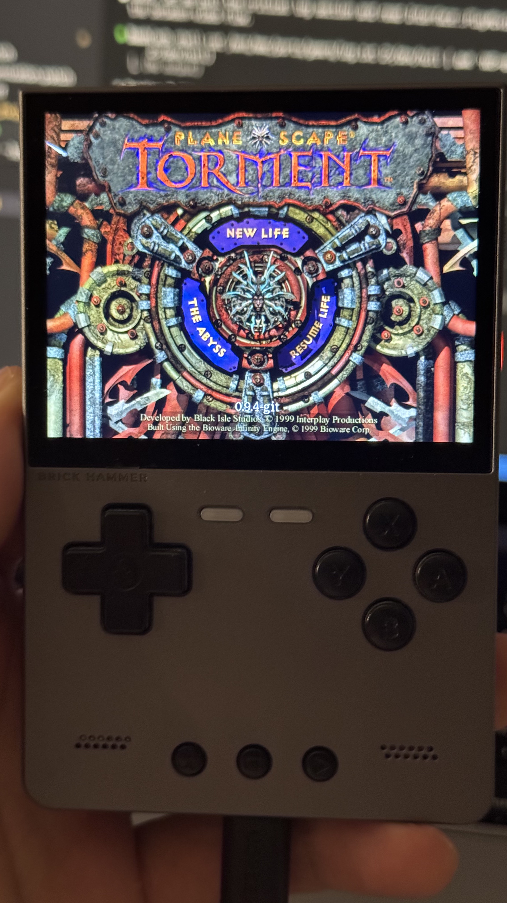
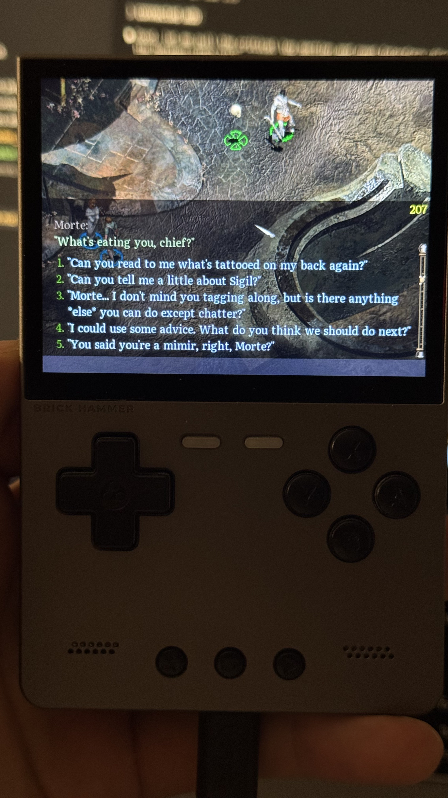

# GemRB — TrimUI Brick Port

A port of [GemRB](https://github.com/gemrb/gemrb) (Planescape: Torment) for the TrimUI Brick handheld, running on MuOS.

## Background

PortMaster's GemRB v0.9.2 had broken fog-of-war transparency on the TrimUI Brick — SDL2 2.30's `SDL_ComposeCustomBlendMode` produces black circles around characters on the PowerVR GE8300 GPU. Upgrading to v0.9.4 or upstream master introduced further GLES2 rendering issues (black screen, missing sprites, blue tint, mispositioned draws). This port fixes all of these with 5 C++ patches and 5 Python UI overrides tuned for handheld play.




## What's Changed

### C++ Patches (`patches/`)

| Patch | What it fixes |
|-------|---------------|
| `CORE_fixes.patch` | OnMouseDrag crash on cursor movement; Esc-during-dialogue guard; viewport centering formula |
| `GLES2_fixes.diff` | Hardcode `OPENGLES2_FOUND` for Docker cross-compile |
| `GLES2_shader_fix.patch` | Separate GL program (not hijacking SDL2's), direct GL draws, full GL state save/restore, GLES2 vertex shader, R↔B channel swap |
| `dialogue_customization.patch` | `SetMargins`/`GetScrollBar` Python bindings, speaker name format, compact option prefixes, keyboard scroll speed |
| `video_fix.patch` | MVE video playback on TBDR GPU (render-target conflict), RGB555 format fix |

### Python UI Overrides (`custom_scripts/pst/`)

| Script | What it does |
|--------|--------------|
| `MessageWindow.py` | 288px dark dialogue window, 18px Literata font, full-width continue button, keyboard scrolling, viewport pan fix |
| `FloatMenuWindow.py` | Null-on-close crash fix, portrait selection outline sync, item use reliability |
| `PortraitWindow.py` | Hide health bars for empty party slots |
| `Container.py` | Fix dialogue flash when opening/closing chests |
| `GUIJRNL.py` | Keyboard scrolling in Journal (Log/Quests/Beasts) |

## Repo Structure

    .
    ├── build.sh                    # Cross-compile for TrimUI Brick (PortMaster Docker)
    ├── deploy.sh                   # Deploy to device via adb (with backup/rollback)
    ├── patches/                    # 5 patches applied to upstream master
    ├── custom_scripts/pst/         # 5 Python UI overrides (shadow upstream GUIScripts/pst/)
    ├── device/                     # Device configs
    │   ├── gemrb.gptk              #   gptokeyb button mapping
    │   ├── fonts/Literata.ttf      #   dialogue font
    │   ├── games/pst/override/     #   fonts.2da override
    │   └── engine/unhardcoded/     #   gemrb.ini (ButtonFont = NORMAL)
    ├── screenshot/                 # Screenshots
    ├── CHANGELOG.md                # Detailed changelog (28 entries across 3 phases)
    ├── upstream-gemrb/             # Upstream GemRB clone (.gitignored)
    └── engine.zip                  # Build output (.gitignored)

## Building

Prerequisites: Docker (for the PortMaster aarch64 cross-compile image).

```bash
# Clone upstream GemRB (one-time)
git clone https://github.com/gemrb/gemrb.git upstream-gemrb

# Build
./build.sh
```

`build.sh` exports upstream commit [`bc6e075`](https://github.com/gemrb/gemrb/commit/bc6e075cd47e20a4835cc40d853d7470bfe0d2a1), applies 5 patches, cross-compiles inside the [PortMaster Docker image](https://github.com/monkeyx-net/portmaster-build-templates), overlays custom Python scripts, and produces `engine.zip` (~18MB, aarch64).

## Deploying

Connect TrimUI Brick via USB and enable adb, then:

```bash
./deploy.sh
```

This backs up the current engine, pushes `engine.zip`, extracts it, and syncs device configs (gptokeyb mapping, fonts, gemrb.ini). The script prints rollback commands in case of issues.

### Game data

PST game files go in `/mnt/mmc/ports/gemrb/games/pst/` on the device, with a `GemRB.cfg` pointing to the data. The launch script is `/mnt/mmc/ROMS/Ports/GemRB.sh`.

## Controls

All input via [gptokeyb](https://github.com/EmuELEC/gptokeyb) — D-pad drives the mouse cursor, buttons map to keyboard/mouse actions.

| Button | Action |
|--------|--------|
| D-pad | Mouse cursor |
| A | Left click |
| B | Escape (back/dismiss) |
| X | Center on character |
| Y | Right click (radial menu) |
| L1 | Scroll up |
| L2 | Scroll down |
| R1 | Highlight objects (Tab) |
| R2 | Wizard spells |
| Start | Pause |
| Select | Quick save |
| Menu | Options |
| Left LED | Inventory |
| Right LED | Map |

Configured in `device/gemrb.gptk`. Mouse speed: `dpad_mouse_step=6`, `mouse_delay=16`.

## Device

- **TrimUI Brick**: Allwinner A133 SoC, PowerVR GE8300 GPU, 1024x768 display
- **OS**: MuOS
- **Resolution**: 640x480 logical (`SDL_RenderSetLogicalSize`)
- **EGL**: `mali-g31-fbdev` — `native_display` passed by value (crashes on struct pointer)
- **Storage**: FAT32 on `/mnt/mmc` — no symlinks

## Upstream

Based on [gemrb/gemrb](https://github.com/gemrb/gemrb) master at commit [`bc6e075`](https://github.com/gemrb/gemrb/commit/bc6e075cd47e20a4835cc40d853d7470bfe0d2a1).
